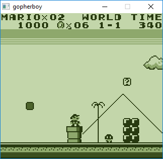
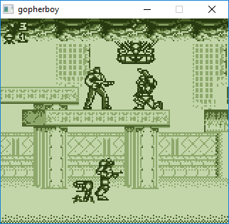
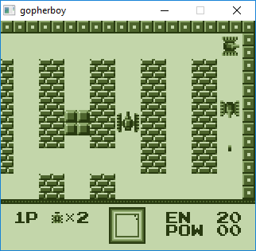
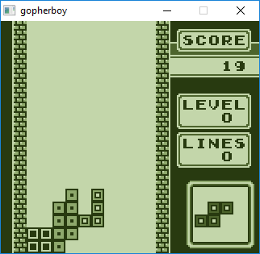
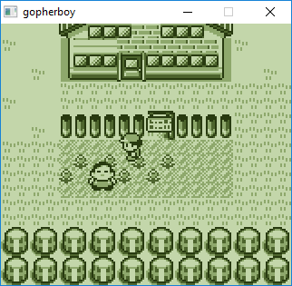
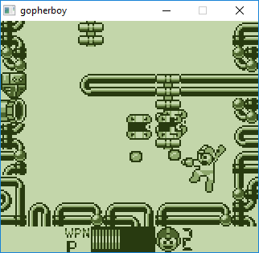

# gopherboy
A Nintendo Game Boy emulator written in golang.

Passes blargg's cpu_instrs.gb test.

tested none-MBC, MBC1, MBC2 and MBC3 roms.

### TODO

1. Save / Load game state.
2. Serial Link.
3. Fix the sound emulation.

### Dependencies

1. go-sdl2: https://github.com/veandco/go-sdl2
2. logrus: https://github.com/sirupsen/logrus
3. protobuf: https://github.com/golang/protobuf

### How to build

1. Follow the instructions for go-sdl2, logrus and protobuf in the links above.
2. go get github.com/moshenahmias/gopherboy
3. go install github.com/moshenahmias/gopherboy

It is possible that you'll need to add the following code to github.com\veandco\go-sdl2\sdl\audio.go (if not already there):

```
// GetQueuedAudioSize (https://wiki.libsdl.org/SDL_GetQueuedAudioSize)
func GetQueuedAudioSize(dev AudioDeviceID) uint32 {
	return (uint32)(C.SDL_GetQueuedAudioSize(dev.c()))
}

// ClearQueuedAudio (https://wiki.libsdl.org/SDL_ClearQueuedAudio)
func ClearQueuedAudio(dev AudioDeviceID) {
	C.SDL_ClearQueuedAudio(dev.c())
}
```

### How to run

```
Usage of gopherboy:

  -bios string
        Path to boot ROM
        
  -rom string
        Path to game ROM
        
  -settings string
        Path to settings file (default "settings.json")    
```

### Default keyboard mapping

| Operation     | Key           |
| ------------- |:-------------:| 
| Up            | Up Arrow      |
| Down          | Down Arrow    |
| Left          | Left Arrow    | 
| Right         | Right Arrow   | 
| A             | Z             | 
| B             | X             | 
| Select        | Space         | 
| Start         | Enter         | 
| Reset         | F1            | 
| Pause         | F2            | 
| Un/Mute Sound | F3            | 
| Exit          | ESC           | 

### Settings

You can change the following settings via the *settings.json* file:

##### Joypad mapping:

```
"joypadMapping": {
        "<sdl keycode>": <joypad keycode>
        ...}       
```

Joypad keycodes: Up = 0, Down = 1, Left = 2, Right = 3, A = 4, B = 5, Select = 6, Start = 7

SDL keycodes: https://wiki.libsdl.org/SDLKeycodeLookup

##### Other settings:

Sound output device, FPS rate, screen size and color palette.

### Screenshots

&nbsp;
&nbsp;
&nbsp;
&nbsp;
&nbsp;
&nbsp;